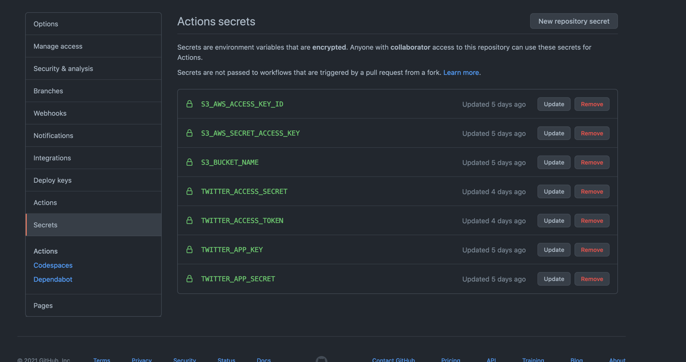

# mytweets

Search all your tweets.


## Features

- Allow importing Archive of [your twitter archive data](https://help.twitter.com/managing-your-account/accessing-your-twitter-data)
    - It means that this app support to search your all twitter history
- Support [Twitter](https://twitter.com) and [Bluesky](https://bsky.app/)
- Fetch the latest tweets via Twitter API/BlueSky API and merge with your history
    - Also, it can be automated by GitHub Actions
- Web Frontend for your Tweets!
  - Support Full text search on to all your tweets
  - [S3 Select](https://docs.aws.amazon.com/AmazonS3/latest/userguide/selecting-content-from-objects.html) based full text search
  - You can create private search engine for you

## Overview


## Usage

1. Click [Use this template](https://github.com/azu/mytweets/generate) and forked repository
    - You can select Public or Private
2. git clone the forked repository

```shell
git clone https://github.com/you/mytweets
cd mytweets
```

This application require following tokens:

- Twitter API token
- S3 Access keys
- S3 buckets for saving tweets.json

You need to put these to `.env` file.

```shell
cp .env.example .env
```

### Twitter

1. Create [Twitter V2 API Client](https://developer.twitter.com/en/portal/dashboard)
2. Get API key, API Key Secret, Acceess Token, Access Token Secret
3. Put these to `.env` file

```
S3_AWS_ACCESS_KEY_ID="x"
S3_AWS_SECRET_ACCESS_KEY="x"
S3_BUCKET_NAME="x"
TWITTER_APP_KEY="YOUR_TWITTER_API_KEY"
TWITTER_APP_SECRET="YOUR_TWITTER_API_KEY_SECRET"
TWITTER_ACCESS_TOKEN="YOUR_TWITTER_ACCESS_TOKEN"
TWITTER_ACCESS_SECRET="YOUR_TWITTER_ACCESS_TOKEN_SECRET"
```

### S3

1. Create S3 bucket for saving your tweets.
2. Create API key on [AWS IAM](https://console.aws.amazon.com/iam/home?region=us-east-1#/users)
    - This API key require GET,PUT,List permissions for S3

Example Permission policies:

:memo: `YOUR_S3_BUCKET_NAME` is the bucket name of Step 1

```json
{
  "Version": "2012-10-17",
  "Statement": [
    {
      "Sid": "mytweets",
      "Effect": "Allow",
      "Action": "s3:*",
      "Resource": "arn:aws:s3:::{your-mytweets-bucket-name}/*"
    }
  ]
}
```

3. Put the API token and S3 bucket name to `.env` file

```shell
S3_AWS_ACCESS_KEY_ID="x"
S3_AWS_SECRET_ACCESS_KEY="x"
S3_BUCKET_NAME="x"
TWITTER_APP_KEY="YOUR_TWITTER_API_KEY"
TWITTER_APP_SECRET="YOUR_TWITTER_API_KEY_SECRET"
TWITTER_ACCESS_TOKEN="YOUR_TWITTER_ACCESS_TOKEN"
TWITTER_ACCESS_SECRET="YOUR_TWITTER_ACCESS_TOKEN_SECRET"
```

## Bluesky

If you want to get [Bluesky](https://bsky.app/) posts, you can use `yarn run fetch-bsky` instead of `yarn run fetch-tweets`.

1. Add your bluesky account to `.env`.

```ts
S3_AWS_ACCESS_KEY_ID="x"
S3_AWS_SECRET_ACCESS_KEY="x"
S3_BUCKET_NAME="x"
BLUESKY_IDENTIFIER="xxx.bsky.social"
BLUESKY_APPPASSWORD="x"
```

2. Use `yarn run fetch-bsky` instead of `yarn run fetch-tweets` in [update workflow](./.github/workflows/update.yml

### Import from Twitter archive

1. Request [your Twitter archive](https://help.twitter.com/en/managing-your-account/how-to-download-your-twitter-archive)
2. Download Twitter archive file like `twitter-*.zip`
3. Copy `tweeet*.js` to `twitter-archives/`

```
twitter-archives/
├── tweet.js
├── tweet-part1.js
└── tweet-part2.js
```

4. Run import commands:

```
yarn install
yarn import-twitter-archives # Concvert twitter-archives
yarn fetch-tweets  # Fetch diffs via Twitter API
yarn upload-s3 # upload to S3
```

### Fetch the latest tweets and merge

> Require: `TWITTER_*` and `S3_*` env in `.env` file

Fetch the latest tweets from your Twitter account using Twitter API.

`yarn fetch-tweets` command fetch tweets and merge it into `tweets.json`.
`yarn upload-s3` upload the `tweets.json` to your S3 bucket.

```
yarn install
yarn download-s3 # download tweets.json from S3
yarn fetch-tweets  # Fetch diffs via Twitter API
yarn prefetch-bsky  # Fetch diffs via Bluesky API
yarn upload-s3 # upload to S3
```

### Deploy Website

You can deploy web frontend to Web Hosting like [Vercel](https://vercel.com/dashboard).

1. Create [Vercel](https://vercel.com/dashboard) account
2. Create new project
3. Select "Import Git Repository"
4. Select your forked repository
5. Set `web/` to "Root Directory"
6. Set following values to "Environment Variables" 
    - `S3_AWS_ACCESS_KEY_ID`
    - `S3_AWS_SECRET_ACCESS_KEY`
    - `S3_BUCKET_NAME`
    - `NEXT_PUBLIC_AUTH_KEY=<secure random string>`
    - ⚠️ If you want to limit access to your website, you should set secure random string to `NEXT_PUBLIC_AUTH_KEY`
    - ℹ️ If you want to allow public access to your website, you should set `"public"` to `NEXT_PUBLIC_AUTH_KEY=public`
7. Deploy
8. You can access to your website like `https://<yourmytweets>.vercel.app/?k=<NEXT_PUBLIC_AUTH_KEY>`.

### Default Search Query

`https://<yourmytweets>.vercel.app/?k=<NEXT_PUBLIC_AUTH_KEY>&q=<search keyword>&max=<max search count>`

The web app support following url queries:

- `?k=<Your Secret Key - same with NEXT_PUBLIC_AUTH_KEY>`
- `&q=<search keyword>`
- `&max=<max search count>`
    - Default: `20`

## Tips

### Schedule Updating

You can automate `yarn fetch-tweets` and `yarn upload-s3` using CI like GitHub Action.

This template repository includes [.github/workflows/update.yml](.github/workflows/update.yml) that update your `tweets.json` daily.

1. Visit your fork repository's setting `https://github.com/owner/mytweets/settings/secrets/actions`
2. Put following env to Action's secrets
    - `S3_AWS_ACCESS_KEY_ID`
    - `S3_AWS_SECRET_ACCESS_KEY`
    - `S3_BUCKET_NAME`
    - If you want to fetch tweets
      - `TWITTER_APP_KEY`
      - `TWITTER_APP_SECRET`
      - `TWITTER_ACCESS_TOKEN`
      - `TWITTER_ACCESS_SECRET`
    - If you want to fetch Bluesky posts
      - `BLUESKY_IDENTIFIER`
      - `BLUESKY_APPPASSWORD`

These value is same to `.env`.



## Related

- [azu/delete-tweets: Twitterのアーカイブから削除候補のTweetsを抽出する補助ツールと削除するツール。](https://github.com/azu/delete-tweets)

## Changelog

See [Releases page](https://github.com/azu/mytweets/releases).

## Running tests

Install devDependencies and Run `npm test`:

    npm test

## Contributing

Pull requests and stars are always welcome.

For bugs and feature requests, [please create an issue](https://github.com/azu/mytweets/issues).

1. Fork it!
2. Create your feature branch: `git checkout -b my-new-feature`
3. Commit your changes: `git commit -am 'Add some feature'`
4. Push to the branch: `git push origin my-new-feature`
5. Submit a pull request :D

## Author

- azu: [GitHub](https://github.com/azu), [Twitter](https://twitter.com/azu_re), [Bluesky](https://bsky.app/profile/azu.bsky.social)

## License

MIT © azu
